# solomd-theme

[SoloMD](https://solomd.app) 的社区主题合集，共 11 款精心设计的主题配色。

> 本仓库主题通过 SoloMD 的 **Custom CSS** 功能加载，也支持加入 SoloMD 主题市场（见 [`themes.json`](./themes.json)）。

## 主题展示

所有主题文件位于 `theme/` 目录，预览图位于 `preview/` 目录。

| 主题文件                  | 主题名               | 类型 | 风格                   |
| ------------------------- | -------------------- | ---- | ---------------------- |
| `theme/aurora.css`        | 极光 Aurora          | 暗色 | 极光渐变，梦幻浪漫     |
| `theme/deep-blue.css`     | 深蓝 Deep Blue       | 暗色 | 深海沉静，冷调         |
| `theme/deep-green.css`    | 深绿 Deep Green      | 暗色 | 森林自然，暖调点缀     |
| `theme/deep-purple.css`   | 深紫 Deep Purple     | 暗色 | 靛紫梦幻，戏剧性       |
| `theme/frost-blue.css`    | 冰蓝 Frost Blue      | 暗色 | 基于 Nord 色板，护眼   |
| `theme/graphite-gray.css` | 石墨灰 Graphite Gray | 暗色 | 高级克制，极简         |
| `theme/ink-blue.css`      | 墨蓝 Ink Blue        | 暗色 | 墨色书房，静谧专注     |
| `theme/rose-pink.css`     | 玫瑰粉 Rose Pink     | 浅色 | 温柔通透，优雅         |
| `theme/soft-ui.css`       | 新拟态 Soft UI       | 浅色 | Neumorphism 浮雕       |
| `theme/warm-sand.css`     | 暖沙 Warm Sand       | 浅色 | Solarized 沙色，高可读 |
| `theme/vscode.css`        | VSCode Modern        | 双色 | 还原 Dark/Light Modern |

### 暗色主题

#### 极光 Aurora

> **强烈推荐** · 标签：`dark` `aurora` `gradient`

深邃夜空打底，角落透出极光绿、冰蓝、紫的柔和光晕，多层渐变营造梦幻浪漫的极光氛围。是所有主题中最具特色、token用的最最最多的一款。

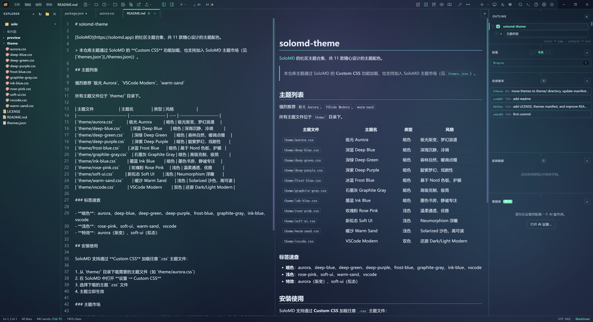

#### 深蓝 Deep Blue

> 标签：`dark` `cool` `blue`

深海军蓝的深渊背景，蓝、青强调色，冷静专注，适合需要长时间保持清醒的写作场景。

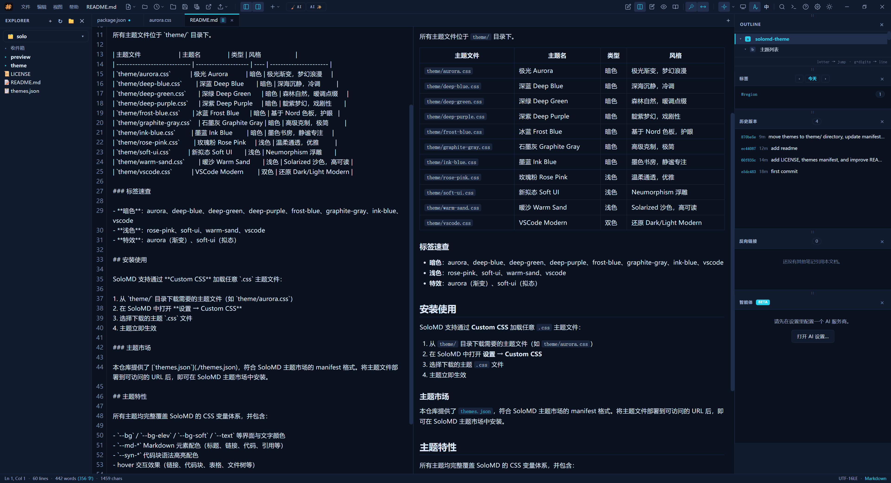

#### 墨蓝 Ink Blue

> 标签：`dark` `cool` `ink`

沉稳的墨色蓝调，微带青绿，如深夜书房般静谧专注，适合长时间写作。

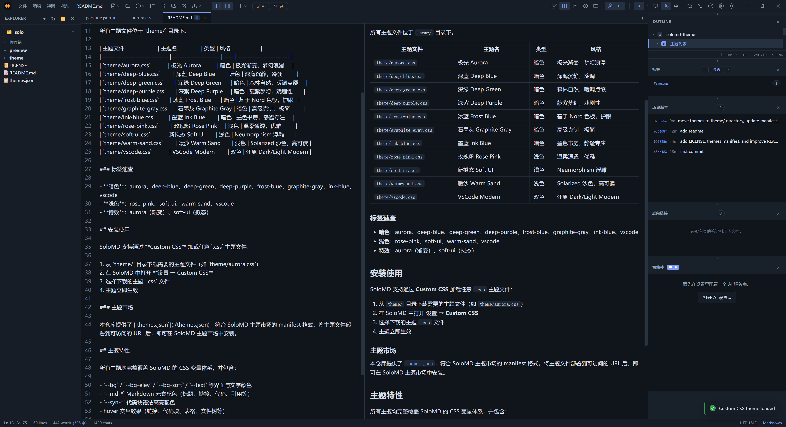

#### 冰蓝 Frost Blue

> 标签：`dark` `cool` `nord`

基于经典 Nord 色板，冰蓝强调色，安静、均衡、护眼，是久经考验的极简之选。

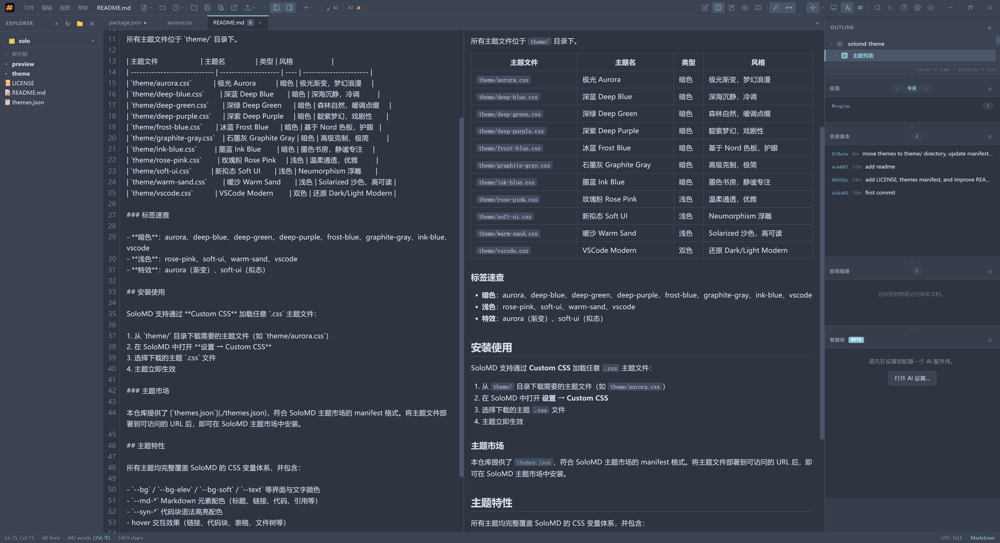

#### 深绿 Deep Green

> 标签：`dark` `nature` `green`

深松绿背景，叶绿、金黄强调色，如置身森林般宁静自然，质朴沉静。

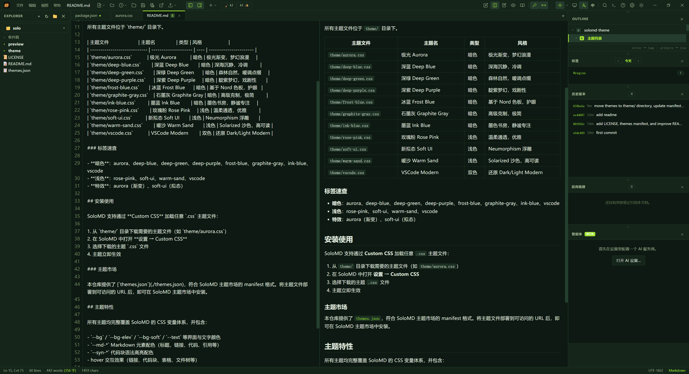

#### 深紫 Deep Purple

> 标签：`dark` `purple`

深靛蓝夜空背景，品红、紫强调色，梦幻且略带戏剧性，个性鲜明。

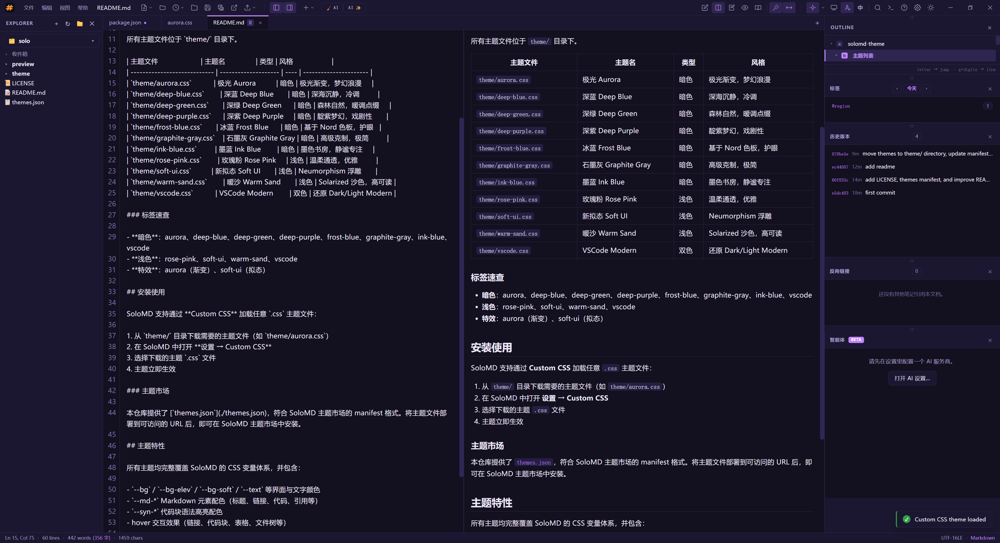

#### 石墨灰 Graphite Gray

> 标签：`dark` `minimal` `gray`

克制的高级冷灰，低饱和、耐看，单一雾蓝点缀，干净利落，长时间使用不刺眼。

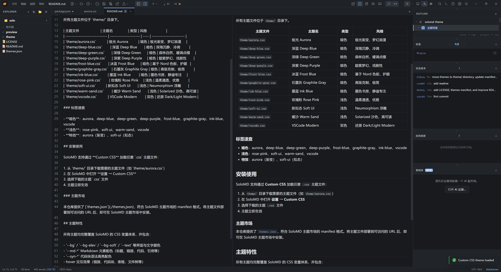

### 双色主题

#### VSCode Modern

> **强烈推荐** · 标签：`dark` `light` `vscode`

参照 VSCode 默认 Dark Modern / Light Modern 官方配色，精确还原经典语法高亮，程序员最熟悉的选择。

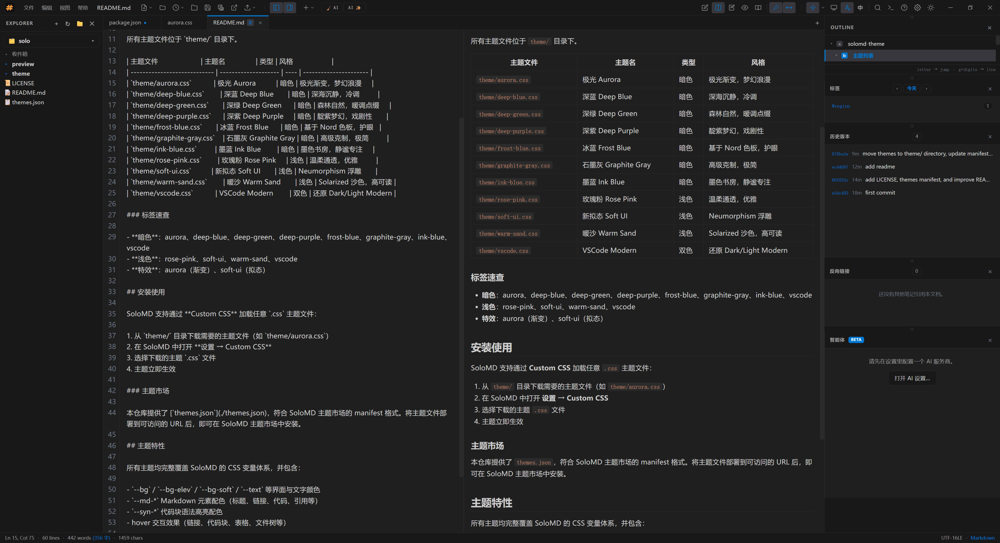

### 浅色主题

#### 玫瑰粉 Rose Pink

> 标签：`light` `warm` `pink`

温柔腮红底色，玫瑰、李子色强调，温暖、通透、优雅，低视觉疲劳。

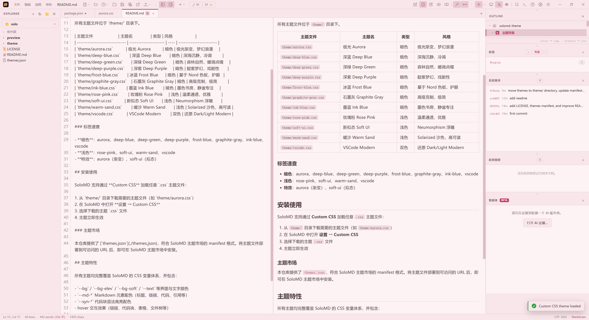

#### 暖沙 Warm Sand

> 标签：`light` `warm` `solarized`

沙色底色配蓝、绿强调色，经典 Solarized 浅色系的极佳可读性，比奶油拿铁更偏沙黄。

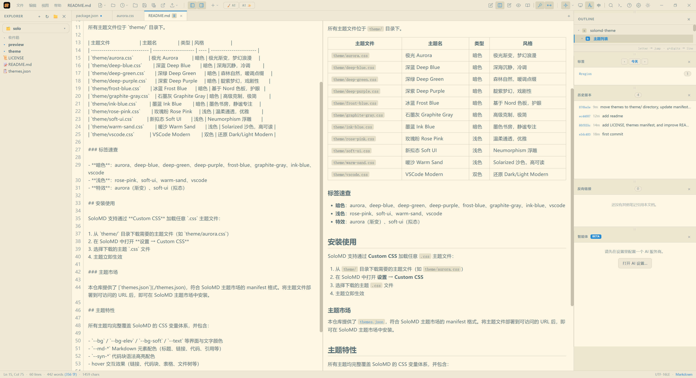

#### 新拟态 Soft UI

> 标签：`light` `soft` `neumorphism`

Neumorphism 新拟态，同色系背景 + 内外柔和阴影，营造凸起/凹陷的立体浮雕质感。

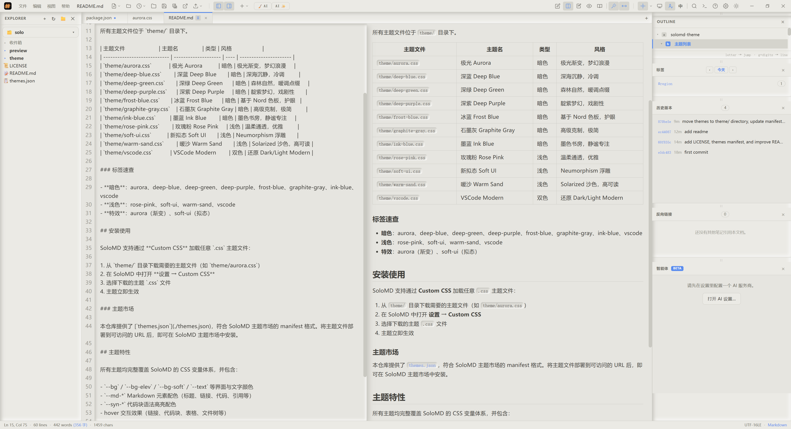

## 标签速查

- **暗色**：aurora、deep-blue、deep-green、deep-purple、frost-blue、graphite-gray、ink-blue、vscode
- **浅色**：rose-pink、soft-ui、warm-sand、vscode
- **特效**：aurora（渐变）、soft-ui（拟态）

## 安装使用

SoloMD 支持通过 **Custom CSS** 加载任意 `.css` 主题文件：

1. 从 `theme/` 目录下载需要的主题文件（如 `theme/aurora.css`）
2. 在 SoloMD 中打开 **设置 → Custom CSS**
3. 选择下载的主题 `.css` 文件
4. 主题立即生效

### 主题市场

本仓库提供了 [`themes.json`](./themes.json)，符合 SoloMD 主题市场的 manifest 格式。将主题文件部署到可访问的 URL 后，即可在 SoloMD 主题市场中安装。

## 主题特性

所有主题均完整覆盖 SoloMD 的 CSS 变量体系，并包含：

- `--bg` / `--bg-elev` / `--bg-soft` / `--text` 等界面与文字颜色
- `--md-*` Markdown 元素配色（标题、链接、代码、引用等）
- `--syn-*` 代码块语法高亮配色
- hover 交互效果（链接、代码块、表格、文件树等）

## 许可证

[MIT](./LICENSE)

Copyright (c) 2026 raopan
